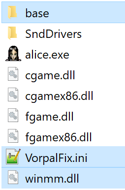

  

A patch that addresses various technical issues and adds quality-of-life improvements to the 2011 remaster of American McGee's Alice, without altering the original game's artistic vision or overwriting any original game files.

## How to Install
> [!NOTE]
> This patch will only work on the 2011 remaster of American McGee's Alice and **will not work on the 2000 version** of the game.
>
> **Download**: [VorpalFix.zip](https://github.com/Wemino/VorpalFix/releases/latest/download/VorpalFix.zip)
>
> Extract the contents of the zip file into the game’s folder, in the same directory as the `alice.exe` file.
> 
> 
> 
> This patch allows the game to launch independently (by executing `alice.exe`), so it is not necessary to install it alongside Alice: Madness Returns.

> [!TIP]  
> If you own *Alice: Madness Returns*, check out [MadnessPatch](https://github.com/Wemino/MadnessPatch)!

### Steam Deck/Linux Specific Instructions (Windows users can skip this)
> [!WARNING]
> To launch the game on Steam Deck or Linux, open the game’s properties in Steam and include `WINEDLLOVERRIDES="winmm.dll=n,b" %command%` in the launch options.

# Features

## General Fixes and Stability

- Fixed missing weapon sounds and Cheshire Cat summon that were broken in the 2011 remaster due to a bug affecting randomized sound effects.

- Fixed the "Hard Disk Full" error message incorrectly appearing when the game is installed on a disk with more than 2TB of free space.

- Fixed a crash that occurred when saving at resolutions where the width is not a multiple of 4 (e.g., 1366x768), as well as another crash that could happen while fetching the resolution list.

- Fixed missing particle effects for re-materialization visuals of Alice's throwable weapons.

- Fixed an issue where Alice's blinking animation in the menu played too quickly at high frame rates.

- Fullscreen selection now persists after restarting.

- Fixed menu texture bleeding, corrected the back button animation that played faster at higher resolutions, and resolved other minor menu UI issues.

- Fixed typos in script files affecting texture and sound paths to prevent missing assets.

- Fixed menu-related issues when playing on Linux via Proton (set `FixProton = 1` in `VorpalFix.ini`, see https://github.com/ValveSoftware/Proton/issues/8179)
  
- Corrected display scaling on high‑DPI monitors.

---

## Widescreen Fixes
- **Menu Aspect Ratio**  
  Maintains correct aspect ratio for in‑game menus and save‑file thumbnails in widescreen resolutions.

  <table>
    <tr>
      <td width="50%"></td>
      <td width="50%"></td>
    </tr>
    <tr>
      <td align="center">Vanilla</td>
      <td align="center">VorpalFix</td>
    </tr>
  </table>

- **FMV Aspect Ratio**  
  Prevents cinematic videos from warping in widescreen resolutions.

  <table>
    <tr>
      <td width="50%"></td>
      <td width="50%"></td>
    </tr>
    <tr>
      <td align="center">Vanilla</td>
      <td align="center">VorpalFix</td>
    </tr>
  </table>

- **HUD Aspect Ratio**  
  Prevents HUD elements from stretching in any widescreen format.

  <table style="width: 130%; max-width: 1200px;">
    <tr>
      <td width="50%"></td>
      <td width="50%"></td>
    </tr>
    <tr>
      <td align="center">Vanilla</td>
      <td align="center">VorpalFix</td>
    </tr>
  </table>

---

## Fix Remastered Character Textures
- **Fixed an issue where multiple typos in the archive containing the remastered textures prevented them from loading.**  
  Affects **Cheshire Cat**, **Card Guards** and **Mock Turtle**.

  <table>
    <tr>
      <td width="50%"></td>
      <td width="50%"></td>
    </tr>
    <tr>
      <td align="center">Original Textures</td>
      <td align="center">Remastered Textures</td>
    </tr>
  </table>

---

## Game Launch and Settings Options

- **Allow the game to launch without Alice: Madness Returns**  
  The 2011 remaster is designed to launch with the `-RunningFromAlice2` option, this check has been disabled by default, allowing `alice.exe` to launch independently.

- **Prevent Alice: Madness Returns from launching on exit**  
  On exit, the game checks the installation path of Alice: Madness Returns to relaunch it.  
  Set `PreventAlice2OnExit = 1` in `VorpalFix.ini`

- **Add a dedicated menu to edit some of the settings of `VorpalFix.ini`**  
  Delete `pak7_VorpalFix_menu.pk3` to remove.

  <table>
    <tr>
      <td width="100%"></td>
    </tr>
    <tr>
      <td align="center">VorpalFix Settings Menu</td>
    </tr>
  </table>

- **Toggle Remastered Models**  
  Switch between remaster and original models without editing game files.

  <table>
    <tr>
      <td width="50%"></td>
      <td width="50%"></td>
    </tr>
    <tr>
      <td align="center">2011 Textures (Remastered)</td>
      <td align="center">2000 Textures (Original)</td>
    </tr>
  </table>

- **Original Title Screen Restored**  
  Restored the "American McGee's Alice" title screen from the Xbox 360/PS3 version that was missing in the PC remaster.

- **Language Options**  
  Select English, German, French, or Spanish from the menu.

- **Original Intro Videos**  
  Restore the EA and Rogue Entertainment intro videos by setting `UseOriginalIntroVideos = 1`.
  
- **Developer Console Re-enabled**  
  Restores access to the original game's console (can be enabled in the game's settings). Default key: F2

- **Custom Save Path**  
  Redirect save files via `CustomSavePath` in `VorpalFix.ini`.

- **Disable Winsock Initialization**  
  Turn off legacy Quake 3 network startup.

---

## Gameplay Options

- **Additional controller commands:**
  - Pressing the Left Stick while pressing any D-pad button will save the current weapon to that D-pad key.
  - Pressing the Right Stick + 'A' will execute a quick load.
  - Pressing the Right Stick + 'B' will execute a quick save.

- **Camera Responsiveness**  
  Adjust camera smoothing via `CameraSmoothingFactor` for improved responsiveness with high-DPI mouse.
 
- **Console-Style HUD Layout**  
  Position the HUD as in the Xbox 360/PS3 versions.

  <table>
    <tr>
      <td width="50%"></td>
      <td width="50%"></td>
    </tr>
    <tr>
      <td align="center">PC HUD Position</td>
      <td align="center">Console HUD Position</td>
    </tr>
  </table>

- **Letterbox Toggle**  
  Disable cinematic bars during cutscenes.

  <table>
    <tr>
      <td width="50%"></td>
      <td width="50%"></td>
    </tr>
    <tr>
      <td align="center">Vanilla</td>
      <td align="center">Letterbox Disabled</td>
    </tr>
  </table>

 
- **Controller Icon Support**  
  Xbox or PlayStation 3 controller icons are displayed in the menus when a controller is detected at startup.
  

  <table>
    <tr>
      <td width="50%"></td>
      <td width="50%"></td>
    </tr>
    <tr>
      <td align="center">Xbox 360 Controller Icons</td>
      <td align="center">PlayStation 3 Controller Icons</td>
    </tr>
  </table>

- **Borderless Fullscreen & VSync**  
  Enable borderless mode and custom frame rate limits, including refresh rate matching.

---

## Graphical Enhancements

- **Field of View Correction**  
  Auto-adjusts 4:3 FOV for widescreen displays.

  <table>
    <tr>
      <td width="50%"></td>
      <td width="50%"></td>
    </tr>
    <tr>
      <td align="center">Vanilla</td>
      <td align="center">VorpalFix</td>
    </tr>
  </table>

- **Texture Filtering**  
  Anisotropic and trilinear filtering sharpen textures and minimize distant blurring or shimmering, even at steep angles, with minimal performance cost.

  <table>
    <tr>
      <td width="50%"></a></td>
      <td width="50%"></a></td>
    </tr>
    <tr>
      <td align="center"><a href="https://raw.githubusercontent.com/Wemino/VorpalFix/refs/heads/main/assets/anisotropic_off.png">Vanilla</a></td>
      <td align="center"><a href="https://raw.githubusercontent.com/Wemino/VorpalFix/refs/heads/main/assets/anisotropic_on.png">Anisotropic Filtering (16x)</a></td>
    </tr>
  </table>

- **Maximum Model Detail**  
  Disable LOD bias to render models at full quality at any distance.

  <table>
    <tr>
      <td width="50%"></td>
      <td width="50%"></td>
    </tr>
    <tr>
      <td align="center">Vanilla</td>
      <td align="center">No Model LOD Bias</td>
    </tr>
  </table>

## Credits
- [MinHook](https://github.com/TsudaKageyu/minhook) for hooking.
- [mINI](https://github.com/metayeti/mINI) for INI file handling.
- [Leanny](https://github.com/Leanny) help with some algorithms.
- [CRASHARKI](https://github.com/CRASHARKI) help with fixing and improving the menu.

## Licensing Exception
This project is licensed under the GNU General Public License (GPL) version 3.0. **However, Electronic Arts (EA)** and **any third parties explicitly authorized by EA** (including but not limited to GOG, Steam, or other distribution platforms) are hereby granted an irrevocable, perpetual, and worldwide exemption from all GPL 3.0 requirements. This exemption allows EA and authorized third parties to use, modify, distribute, sublicense, or bundle this codebase in any form (including proprietary/closed-source derivative works) for the purpose of re-releasing, preserving, maintaining, or commercially exploiting *American McGee’s Alice*, without any obligation to disclose source code, copyleft restrictions, or other GPL 3.0 terms.

This exception applies solely to EA and its authorized third parties. All other users remain subject to the terms of the GPL 3.0.
